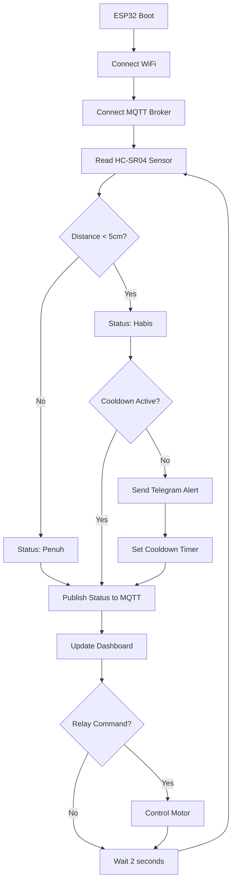
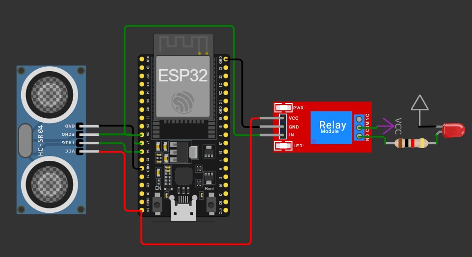
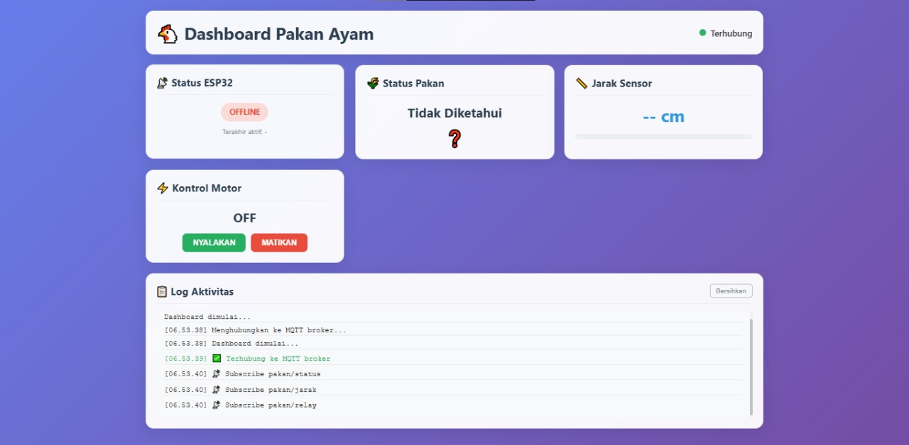
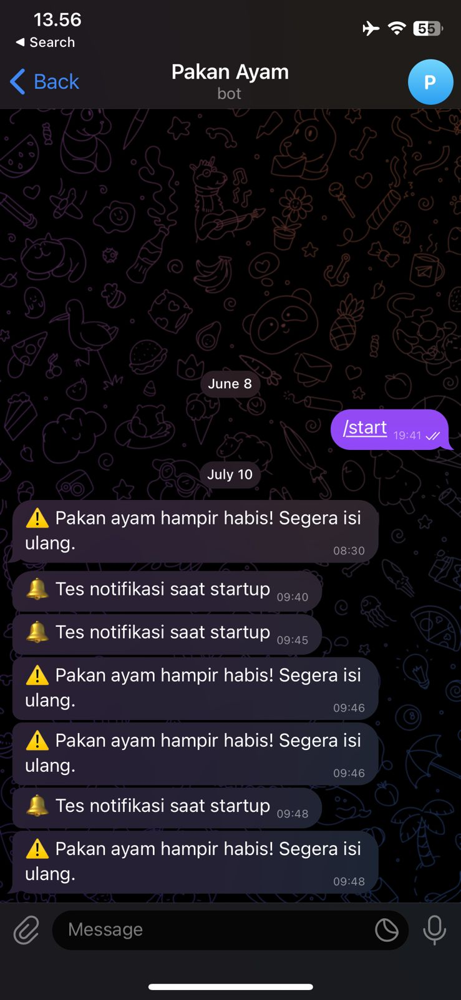

<h1 align="center">🐔 Sistem Pakan Ayam Otomatis dengan ESP32</h1>

<p align="center">
  
</p>

<p align="center">
  <em>Sistem IoT untuk memantau dan mengontrol pakan ayam menggunakan ESP32, sensor ultrasonik, MQTT, dan notifikasi Telegram</em>
</p>

<p align="center">
  
  
  
  
  
  
  <a href="https://github.com/ficrammanifur/ficrammanifur/blob/main/LICENSE">
      
  </a>
</p>

---

## 📑 Table of Contents

- [✨ Overview](#-overview)
- [🚀 Fitur](#-fitur)
- [🏗️ Arsitektur Sistem](#️-arsitektur-sistem)
- [🛠 Komponen](#-komponen)
- [📁 Struktur File](#-struktur-file)
- [⚙️ Instalasi](#️-instalasi)
- [🚀 Cara Penggunaan](#-cara-penggunaan)
- [🧪 Testing & Simulasi](#-testing--simulasi)
- [📊 Monitoring](#-monitoring)
- [🔧 Konfigurasi](#-konfigurasi)
- [🐞 Troubleshooting](#-troubleshooting)
- [🤝 Kontribusi](#-kontribusi)
- [📄 Lisensi](#-lisensi)

---

## ✨ Overview

**Sistem Pakan Ayam Otomatis** adalah solusi IoT modern untuk peternakan ayam yang menggunakan ESP32 sebagai kontroler utama. Sistem ini memantau level pakan secara real-time dan memberikan notifikasi otomatis ketika pakan hampir habis.

### 🎯 Keunggulan Sistem
- **Monitoring Real-time** - Pantau status pakan 24/7
- **Notifikasi Cerdas** - Alert Telegram dengan cooldown anti-spam
- **Kontrol Jarak Jauh** - Dashboard web untuk kontrol motor pakan
- **Hemat Biaya** - Menggunakan komponen yang terjangkau
- **Mudah Dipasang** - Plug and play dengan konfigurasi minimal

---

## 🚀 Fitur

- ✅ **Pemantauan Jarak Pakan**  
  Sensor HC-SR04 mendeteksi status pakan: < 5 cm = *Habis*, > 5 cm = *Penuh*

- ✅ **Kontrol Relay Otomatis**  
  Mengatur motor pakan melalui dashboard web via protokol MQTT

- ✅ **Notifikasi Telegram Cerdas**  
  Kirim pesan otomatis saat pakan habis dengan cooldown 1 jam (anti-spam)

- ✅ **Dashboard Web Responsif**  
  Interface modern untuk monitoring status dan kontrol real-time

- ✅ **Komunikasi MQTT**  
  Protokol komunikasi yang reliable untuk ESP32 ↔ Dashboard

- ✅ **Simulasi Wokwi**  
  Dapat diuji menggunakan simulator online sebelum implementasi fisik

---

## 🏗️ Arsitektur Sistem

### 🔗 Diagram Blok Sistem

```text
┌─────────────────┐    WiFi     ┌─────────────────┐    MQTT    ┌─────────────────┐
│   Dashboard     │ ◄─────────► │      ESP32      │ ◄────────► │  MQTT Broker    │
│   Web Client    │             │  (Controller)   │            │  (HiveMQ)       │
└─────────────────┘             └─────────────────┘            └─────────────────┘
                                         │
                                         │ GPIO
                                         ▼
                    ┌────────────────────────────────────────┐
                    │              Hardware Layer            │
                    │  ┌─────────────┐    ┌─────────────┐    │
                    │  │   HC-SR04   │    │    Relay    │    │
                    │  │   Sensor    │    │   Module    │    │
                    │  │             │    │             │    │
                    │  │ Trig: Pin14 │    │  Pin: 26    │    │
                    │  │ Echo: Pin27 │    │             │    │
                    │  └─────────────┘    └─────────────┘    │
                    └────────────────────────────────────────┘
                                         │
                                         ▼
                    ┌────────────────────────────────────────┐
                    │            Physical Layer              │
                    │  ┌─────────────┐    ┌─────────────┐    │
                    │  │   Feeder    │    │   Motor     │    │
                    │  │   Container │    │   Pakan     │    │
                    │  └─────────────┘    └─────────────┘    │
                    └────────────────────────────────────────┘
```

### 📊 Flow Diagram



---

## 🛠 Komponen

### 📦 Perangkat Keras

| Komponen | Spesifikasi | Pin Connection | Fungsi |
|----------|-------------|----------------|---------|
| **ESP32** | ESP32-WROOM-32 | - | Mikrokontroler utama |
| **HC-SR04** | Ultrasonic Sensor | Trig: 14, Echo: 27 | Deteksi jarak pakan |
| **Relay Module** | 5V Single Channel | Signal: 26 | Kontrol motor pakan |
| **Power Supply** | 5V 2A | VIN, GND | Catu daya sistem |
| **Jumper Wires** | Male-Female | - | Koneksi antar komponen |

### 💻 Perangkat Lunak

| Software | Version | Fungsi |
|----------|---------|---------|
| **Arduino IDE** | 2.0+ | Development environment |
| **ESP32 Board Package** | 2.0.0+ | ESP32 support |
| **MQTT.js** | Latest | Web dashboard communication |
| **HiveMQ Broker** | Public | MQTT message broker |
| **Telegram Bot API** | v6.0+ | Push notifications |

---

## 📁 Struktur File

```text
chicken-feeder-esp32/
├── 📄 README.md                    # Dokumentasi proyek
├── 📋 LICENSE                      # MIT License
├── 🤖 ESP32/
│   └── pakan_ayam.ino             # Kode utama ESP32
├── 🌐 web-dashboard/
│   ├── index.html                 # Dashboard interface
│   ├── main.js                    # MQTT logic & controls
│   └── style.css                  # Responsive styling
├── 📊 simulation/
│   └── wokwi-project.json         # Wokwi simulation config
├── 🖼️ assets/
│   ├── circuit-diagram.png        # Skema rangkaian
│   ├── dashboard-preview.png      # Preview dashboard
│   └── telegram-notification.png  # Contoh notifikasi
└── 📖 docs/
    ├── installation-guide.md      # Panduan instalasi detail
    └── troubleshooting.md         # Panduan troubleshooting
```

---

## ⚙️ Instalasi

### 1. 🔧 Persiapan Hardware

#### Wiring Diagram
<p align="center">
  
</p>

#### Koneksi Pin

```text
ESP32          HC-SR04
─────────────────────────
3.3V     ───►  VCC
GND      ───►  GND
Pin 14   ───►  Trig
Pin 27   ───►  Echo

ESP32          Relay Module
─────────────────────────
5V       ───►  VCC
GND      ───►  GND
Pin 26   ───►  IN
```

### 2. 📱 Setup Telegram Bot

1. **Buat Bot Baru**
   ```
   1. Chat dengan @BotFather di Telegram
   2. Kirim /newbot
   3. Ikuti instruksi untuk nama bot
   4. Simpan BOT_TOKEN yang diberikan
   ```

2. **Dapatkan Chat ID**
   ```bash
   # Kirim pesan ke bot Anda, lalu akses URL ini:
   https://api.telegram.org/bot<YOUR_BOT_TOKEN>/getUpdates
   
   # Cari "chat":{"id": XXXXXXX
   # Simpan angka tersebut sebagai CHAT_ID
   ```

### 3. 💻 Setup Arduino IDE

1. **Install ESP32 Board**
   ```
   File → Preferences → Additional Board Manager URLs:
   https://dl.espressif.com/dl/package_esp32_index.json
   
   Tools → Board → Boards Manager → Search "ESP32" → Install
   ```

2. **Install Required Libraries**
   ```
   Tools → Manage Libraries → Install:
   - WiFi (built-in)
   - HTTPClient (built-in)  
   - PubSubClient by Nick O'Leary
   - ArduinoJson by Benoit Blanchon
   ```

### 4. ⚙️ Konfigurasi Kode

Edit file `arduino/pakan_ayam.ino`:

```cpp
// WiFi Configuration
const char* ssid = "YOUR_WIFI_SSID";
const char* password = "YOUR_WIFI_PASSWORD";

// Telegram Configuration  
const String BOT_TOKEN = "YOUR_BOT_TOKEN";
const String CHAT_ID = "YOUR_CHAT_ID";

// MQTT Configuration
const char* mqtt_server = "broker.hivemq.com";
const int mqtt_port = 1883;
const char* mqtt_client_id = "ChickenFeeder_001";
```

### 5. 🌐 Deploy Web Dashboard

#### Option A: GitHub Pages
```bash
git clone https://github.com/ficrammanifur/chicken-feeder-esp32.git
cd chicken-feeder-esp32
git add .
git commit -m "Initial setup"
git push origin main

# Enable GitHub Pages di repository settings
```

#### Option B: Local Server
```bash
cd web-dashboard
python -m http.server 8080
# Akses: http://localhost:8080
```

---

## 🚀 Cara Penggunaan

### 📋 Step-by-Step Operation

1. **🔌 Power On System**
   - Hubungkan ESP32 ke power supply
   - Tunggu hingga LED built-in berkedip (WiFi connected)
   - Cek Serial Monitor untuk konfirmasi koneksi

2. **🌐 Akses Dashboard**
   ```
   URL: https://yourusername.github.io/chicken-feeder-esp32
   ```

3. **📊 Monitor Status**
   - **Jarak**: Menampilkan jarak sensor ke pakan (cm)
   - **Status**: Habis (<5cm) atau Penuh (≥5cm)  
   - **Relay**: ON/OFF status motor pakan
   - **Last Update**: Timestamp update terakhir

4. **🎛️ Kontrol Manual**
   - Klik tombol **NYALAKAN** untuk menjalankan motor
   - Klik tombol **MATIKAN** untuk menghentikan motor
   - Status akan update secara real-time

5. **📱 Notifikasi Telegram**
   - Otomatis terkirim saat pakan habis
   - Cooldown 1 jam untuk mencegah spam
   - Format: "⚠️ Pakan ayam hampir habis! Segera isi ulang."

---

## 🧪 Testing & Simulasi

### 🖥️ Wokwi Simulator

Proyek ini dapat diuji menggunakan [Wokwi Simulator](https://wokwi.com/projects/418547391166436353):

1. **Import Project**
   ```
   https://wokwi.com/projects/new/esp32
   Copy-paste kode dari pakan_ayam.ino
   ```

2. **Add Components**
   - ESP32
   - HC-SR04 Ultrasonic Sensor  
   - Relay Module
   - Connecting wires

3. **Limitations**
   ⚠️ **Catatan**: Wokwi tidak mendukung:
   - HTTP requests (Telegram notifications)
   - Real WiFi connection
   - MQTT over internet

### 🔬 Physical Testing

#### Test Sensor Ultrasonik
```cpp
// Monitor Serial output
void loop() {
  float distance = getDistance();
  Serial.print("Jarak: ");
  Serial.print(distance);
  Serial.println(" cm");
  delay(1000);
}
```

#### Test Telegram Notification
```bash
# Manual test via browser/curl
https://api.telegram.org/bot<BOT_TOKEN>/sendMessage?chat_id=<CHAT_ID>&text=Test%20notification
```

#### Test MQTT Communication
```bash
# Subscribe to topics
mosquitto_sub -h broker.hivemq.com -t "pakan/status"
mosquitto_sub -h broker.hivemq.com -t "pakan/jarak"  
mosquitto_sub -h broker.hivemq.com -t "pakan/relay"

# Publish test commands
mosquitto_pub -h broker.hivemq.com -t "pakan/relay/control" -m "ON"
mosquitto_pub -h broker.hivemq.com -t "pakan/relay/control" -m "OFF"
```

---

## 📊 Monitoring

### 🖥️ Serial Monitor Output

Baud Rate: **115200**

```text
[INFO] WiFi connected: 192.168.1.100
[INFO] MQTT connected to broker.hivemq.com
[INFO] Telegram bot ready
─────────────────────────────────────
📏 Jarak: 12.45 cm
📤 Status pakan: Penuh  
🔌 Relay status: OFF
📡 Data published to MQTT
─────────────────────────────────────
📏 Jarak: 3.21 cm
📤 Status pakan: Habis
⚠️  Pakan habis terdeteksi!
ℹ️  Mencoba kirim notifikasi...
✅ Notifikasi terkirim ke Telegram
🔌 Relay status: OFF
📡 Data published to MQTT
─────────────────────────────────────
```

### 📱 Dashboard Web Interface

<p align="center">
  
</p>

**Features:**
- Real-time status updates
- Interactive relay controls  
- Responsive design (mobile-friendly)
- Connection status indicator
- Historical data display

### 📲 Telegram Notifications

<p align="center">
  
</p>

**Format Pesan:**
```
🐔 Chicken Feeder Alert

⚠️ Pakan ayam hampir habis!
📏 Jarak terdeteksi: 3.2 cm
⏰ Waktu: 2024-01-15 14:30:25

Segera isi ulang pakan untuk menjaga kesehatan ayam Anda.
```

---

## 🔧 Konfigurasi

### ⚙️ Parameter Sistem

Edit konstanta di `pakan_ayam.ino`:

```cpp
// Sensor Configuration
#define TRIG_PIN 14
#define ECHO_PIN 27
#define RELAY_PIN 26

// Thresholds
#define EMPTY_THRESHOLD 5.0    // cm - batas pakan habis
#define MAX_DISTANCE 400.0     // cm - jarak maksimum sensor

// Timing Configuration  
#define SENSOR_DELAY 2000      // ms - interval pembacaan sensor
#define NOTIF_COOLDOWN 3600000 // ms - cooldown notifikasi (1 jam)
#define MQTT_KEEPALIVE 60      // seconds - MQTT keepalive

// MQTT Topics
#define TOPIC_STATUS "pakan/status"
#define TOPIC_DISTANCE "pakan/jarak"  
#define TOPIC_RELAY "pakan/relay"
#define TOPIC_CONTROL "pakan/relay/control"
```

### 🌐 Web Dashboard Configuration

Edit `web-dashboard/main.js`:

```javascript
// MQTT Broker Configuration
const MQTT_BROKER = 'wss://broker.hivemq.com:8884/mqtt';
const MQTT_OPTIONS = {
    keepalive: 60,
    clientId: 'ChickenFeeder_Dashboard_' + Math.random().toString(16).substr(2, 8),
    protocolId: 'MQTT',
    protocolVersion: 4,
    clean: true,
    reconnectPeriod: 1000,
    connectTimeout: 30 * 1000
};

// Update Intervals
const STATUS_UPDATE_INTERVAL = 1000; // ms
const CONNECTION_CHECK_INTERVAL = 5000; // ms
```

### 📱 Telegram Configuration

```cpp
// Telegram Bot Settings
const String BOT_TOKEN = "1234567890:ABCdefGHIjklMNOpqrsTUVwxyz";
const String CHAT_ID = "123456789";
const String BOT_NAME = "ChickenFeederBot";

// Message Templates
const String EMPTY_MESSAGE = "⚠️ Pakan ayam hampir habis! Segera isi ulang.";
const String SYSTEM_START = "🐔 Sistem pakan ayam telah aktif dan siap beroperasi.";
const String SYSTEM_ERROR = "❌ Terjadi error pada sistem pakan ayam.";
```

---

## 🐞 Troubleshooting

### ❌ Common Issues & Solutions

#### **1. WiFi Connection Failed**

**Symptoms:**
```text
[ERROR] WiFi connection failed
[ERROR] Retrying in 5 seconds...
```

**Solutions:**
- ✅ Periksa SSID dan password WiFi
- ✅ Pastikan ESP32 dalam jangkauan WiFi
- ✅ Restart router jika perlu
- ✅ Coba gunakan hotspot mobile untuk testing

```cpp
// Debug WiFi connection
void connectWiFi() {
  Serial.print("Connecting to ");
  Serial.println(ssid);
  
  WiFi.begin(ssid, password);
  int attempts = 0;
  
  while (WiFi.status() != WL_CONNECTED && attempts < 20) {
    delay(500);
    Serial.print(".");
    attempts++;
  }
  
  if (WiFi.status() == WL_CONNECTED) {
    Serial.println("\nWiFi connected!");
    Serial.print("IP address: ");
    Serial.println(WiFi.localIP());
  } else {
    Serial.println("\nWiFi connection failed!");
  }
}
```

#### **2. MQTT Connection Issues**

**Symptoms:**
```text
[ERROR] MQTT connection failed, rc=-2
[ERROR] Retrying MQTT connection...
```

**Solutions:**
- ✅ Periksa koneksi internet
- ✅ Coba broker alternatif: `test.mosquitto.org`
- ✅ Periksa firewall/port blocking
- ✅ Gunakan client ID yang unik

```cpp
// MQTT Error Codes
// -4 : Connection timeout
// -3 : Connection lost  
// -2 : Connect failed
// -1 : Disconnected
//  0 : Connected
//  1 : Bad protocol
//  2 : Bad client ID
//  3 : Unavailable
//  4 : Bad credentials
//  5 : Unauthorized
```

#### **3. Sensor Reading -1 (Invalid)**

**Symptoms:**
```text
📏 Jarak: -1.00 cm
📤 Status: Error
```

**Solutions:**
- ✅ Periksa wiring HC-SR04
- ✅ Pastikan power supply 5V stabil
- ✅ Cek tidak ada objek menghalangi sensor
- ✅ Ganti sensor jika rusak

```cpp
// Enhanced sensor reading with error handling
float getDistance() {
  digitalWrite(TRIG_PIN, LOW);
  delayMicroseconds(2);
  digitalWrite(TRIG_PIN, HIGH);
  delayMicroseconds(10);
  digitalWrite(TRIG_PIN, LOW);
  
  long duration = pulseIn(ECHO_PIN, HIGH, 30000); // 30ms timeout
  
  if (duration == 0) {
    Serial.println("[ERROR] Sensor timeout");
    return -1;
  }
  
  float distance = duration * 0.034 / 2;
  
  if (distance > MAX_DISTANCE) {
    Serial.println("[ERROR] Distance out of range");
    return -1;
  }
  
  return distance;
}
```

#### **4. Telegram Notifications Not Working**

**Symptoms:**
```text
ℹ️ Mencoba kirim notifikasi...
❌ HTTP Error: -1
```

**Solutions:**
- ✅ Verifikasi BOT_TOKEN dan CHAT_ID
- ✅ Test manual via browser
- ✅ Periksa koneksi HTTPS
- ✅ Pastikan bot tidak di-block

```bash
# Manual test Telegram API
curl -X POST "https://api.telegram.org/bot<BOT_TOKEN>/sendMessage" \
     -H "Content-Type: application/json" \
     -d '{"chat_id": "<CHAT_ID>", "text": "Test message"}'
```

#### **5. Dashboard Not Updating**

**Symptoms:**
- Dashboard shows "Disconnected"
- No real-time updates
- Control buttons not working

**Solutions:**
- ✅ Check browser console for errors
- ✅ Verify MQTT broker connection
- ✅ Clear browser cache
- ✅ Try different browser

```javascript
// Debug MQTT in browser console
client.on('connect', function () {
    console.log('MQTT Connected');
});

client.on('error', function (error) {
    console.log('MQTT Error:', error);
});

client.on('message', function (topic, message) {
    console.log('Received:', topic, message.toString());
});
```

### 🔧 Advanced Debugging

#### Enable Debug Mode

```cpp
// Add to top of pakan_ayam.ino
#define DEBUG_MODE 1

#if DEBUG_MODE
  #define DEBUG_PRINT(x) Serial.print(x)
  #define DEBUG_PRINTLN(x) Serial.println(x)
#else
  #define DEBUG_PRINT(x)
  #define DEBUG_PRINTLN(x)
#endif
```

#### Memory Usage Monitoring

```cpp
void printMemoryUsage() {
  DEBUG_PRINT("Free heap: ");
  DEBUG_PRINT(ESP.getFreeHeap());
  DEBUG_PRINTLN(" bytes");
}
```

#### Network Diagnostics

```cpp
void networkDiagnostics() {
  DEBUG_PRINTLN("=== Network Diagnostics ===");
  DEBUG_PRINT("WiFi Status: ");
  DEBUG_PRINTLN(WiFi.status());
  DEBUG_PRINT("IP Address: ");
  DEBUG_PRINTLN(WiFi.localIP());
  DEBUG_PRINT("Signal Strength: ");
  DEBUG_PRINT(WiFi.RSSI());
  DEBUG_PRINTLN(" dBm");
  DEBUG_PRINTLN("===========================");
}
```

---

## 🤝 Kontribusi

Kontribusi sangat diterima! Mari bersama-sama mengembangkan sistem ini.

### 📋 How to Contribute

1. **Fork** repository ini
2. **Create** feature branch (`git checkout -b feature/AmazingFeature`)
3. **Commit** changes (`git commit -m 'Add some AmazingFeature'`)
4. **Push** to branch (`git push origin feature/AmazingFeature`)
5. **Open** Pull Request

### 🎯 Areas for Contribution

- [ ] **Mobile App** - Develop native Android/iOS app
- [ ] **Data Logging** - Add database integration for historical data
- [ ] **Multiple Sensors** - Support for multiple feeding stations
- [ ] **AI Integration** - Predictive feeding based on consumption patterns
- [ ] **Security** - Add authentication and encryption
- [ ] **Documentation** - Improve docs and add video tutorials

### 🐛 Bug Reports

Gunakan GitHub Issues dengan template berikut:

```markdown
**Bug Description:**
Brief description of the issue

**Hardware Setup:**
- ESP32 model: 
- Sensor model:
- Power supply:

**Software Environment:**
- Arduino IDE version:
- ESP32 board package version:
- Library versions:

**Steps to Reproduce:**
1. Step one
2. Step two  
3. Step three

**Expected Behavior:**
What should happen

**Actual Behavior:**
What actually happens

**Serial Monitor Output:**
```
Paste serial monitor output here
```

**Additional Context:**
Any other relevant information
```

### 💡 Feature Requests

Untuk request fitur baru, buat GitHub Issue dengan label "enhancement":

```markdown
**Feature Description:**
Clear description of the proposed feature

**Use Case:**
Why is this feature needed?

**Proposed Implementation:**
How should this feature work?

**Additional Notes:**
Any other relevant information
```

---

## 👨‍💻 Pengembang

**Ficram Manifur**
- 🐙 GitHub: [@ficrammanifur](https://github.com/ficrammanifur)
- 🌐 Portfolio: [ficrammanifur.github.io/ficram-portfolio](https://ficrammanifur.github.io/ficram-portfolio)
- 📧 Email: ficramm@gmail.com

---

## 🙏 Acknowledgments

- **ESP32 Community** - Untuk dokumentasi dan library yang luar biasa
- **HiveMQ** - Public MQTT broker untuk development dan testing
- **Telegram** - Bot API yang mudah digunakan
- **Wokwi** - Platform simulasi yang membantu development
- **Arduino Community** - Ecosystem yang mendukung project IoT
- **Open Source Contributors** - Yang telah berkontribusi pada libraries yang digunakan

---

## 📄 Lisensi

Proyek ini dilisensikan di bawah [MIT License](LICENSE).

```text
MIT License

Copyright (c) 2024 Ficram Manifur

Permission is hereby granted, free of charge, to any person obtaining a copy
of this software and associated documentation files (the "Software"), to deal
in the Software without restriction, including without limitation the rights
to use, copy, modify, merge, publish, distribute, sublicense, and/or sell
copies of the Software, and to permit persons to whom the Software is
furnished to do so, subject to the following conditions:

The above copyright notice and this permission notice shall be included in all
copies or substantial portions of the Software.

THE SOFTWARE IS PROVIDED "AS IS", WITHOUT WARRANTY OF ANY KIND, EXPRESS OR
IMPLIED, INCLUDING BUT NOT LIMITED TO THE WARRANTIES OF MERCHANTABILITY,
FITNESS FOR A PARTICULAR PURPOSE AND NONINFRINGEMENT. IN NO EVENT SHALL THE
AUTHORS OR COPYRIGHT HOLDERS BE LIABLE FOR ANY CLAIM, DAMAGES OR OTHER
LIABILITY, WHETHER IN AN ACTION OF CONTRACT, TORT OR OTHERWISE, ARISING FROM,
OUT OF OR IN CONNECTION WITH THE SOFTWARE OR THE USE OR OTHER DEALINGS IN THE
SOFTWARE.
```

---

## 📈 Roadmap

### 🎯 Version 2.0 (Planned)

- [ ] **Multi-Station Support** - Kontrol beberapa tempat pakan
- [ ] **Data Analytics** - Grafik konsumsi pakan harian/mingguan
- [ ] **Mobile App** - Aplikasi Android/iOS native
- [ ] **Voice Alerts** - Notifikasi suara melalui speaker
- [ ] **Camera Integration** - Monitoring visual kandang ayam

### 🎯 Version 3.0 (Future)

- [ ] **AI Prediction** - Prediksi kebutuhan pakan berdasarkan pola
- [ ] **Weather Integration** - Penyesuaian pakan berdasarkan cuaca
- [ ] **Blockchain Logging** - Immutable record untuk traceability
- [ ] **Solar Power** - Integrasi dengan panel surya
- [ ] **Mesh Network** - Komunikasi antar multiple stations

---

<div align="center">

**🐔 Making Poultry Farming Smarter with IoT**

**⚡ Built with ESP32, MQTT & Telegram API**

**⭐ Star this repo if you like it!**

<p><a href="#top">⬆ Kembali ke Atas</a></p>

</div>
